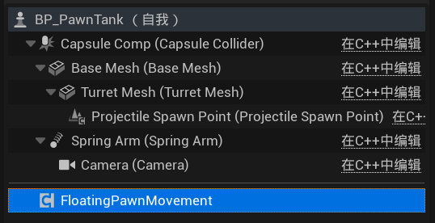

# Unreal 5 操作笔记

[TOC]

## 1. 基本操作

**打开Content Drawer**：Ctrl + 空格键

**选择场景物体对应的文件**：在场景中选择（多选）物体后按Ctrl + B

**测量大小**：在非透视视图中按住鼠标中键可以测量物体大小， 100 unreal units = 1m

**preview mesh**：按住 "\\" 键查看preview mesh来判断场景物体大小是否合适，可以在“编辑器偏好设置”中修改preview mesh使用的模型 

**轮廓**：G，显示或隐藏所有好用的工具（轮廓，网格，枢轴，图标等）

**玩家模式**：运行后点击F8开关该模式

## 2. 材质

**迁移节点**：按住Ctrl点击节点进行拖拽，可以将该节点连的所有线移到其他节点

**改变材质预览光照位置**：按住L + 鼠标左键

**公共节点**：选择想要放在一起的节点，点击C键

## 3. 网格体绘制模式

**改变绘制大小**：参数栏调整或使用” [ “、 ” ] “键来缩小或放大

**擦除颜色**：按住shift移动鼠标进行擦除

**切换绘制/擦除颜色**：X键

## 4. 设置控制视角的ITEM

选择用来控制视角的ITEM，搜索Auto Possess Player，将自动控制玩家设置为玩家0，本地多人的游戏有另外的设置方法，注意所有item里只能有一个被设置为玩家0

## 5. 使用AddMovementInput()注意事项

对于**Pawn类**的蓝图，必须手动添加FloatingPawnMovement组件后AddMovementInput才会生效；

对于**Character类**的蓝图，创建时自带UCharacterMovementComponent，所以不需要手动添加；

## 6. 为AI Controller启用Movement Controller

务必打开MoveComponent里的“**在无控制器的情况下运行物理**”，否则重力，运动等功能将失效

## 7. Groom毛发不显示（启动groom绑定后 或者导入第三方角色带头发 头发不显示）

UE5 Groom毛发设置绑定后 消失不见问题 或者导入第三方角色 涉及到毛发不显示

支持 Groom 插件要事先开启

第一，需要确定 项目设置-SupportCompute Skin Cache 为**开启**状态

第二，确定skeltal mesh 属性页 Skin Cache Uage 为 **Enable** 的状态

修改以上设置后需要**重启引擎**
